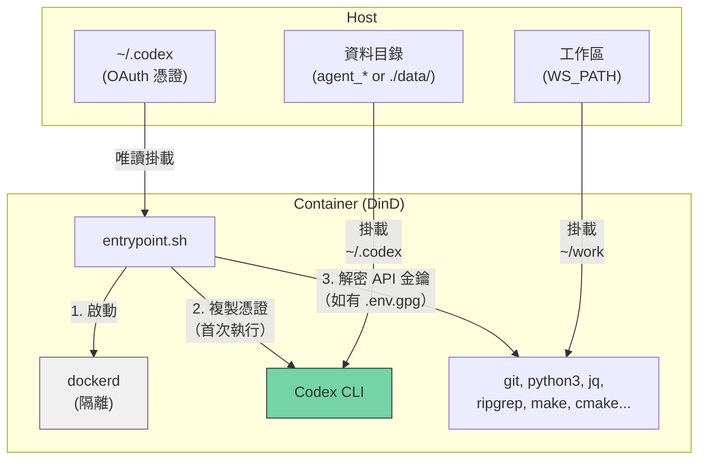
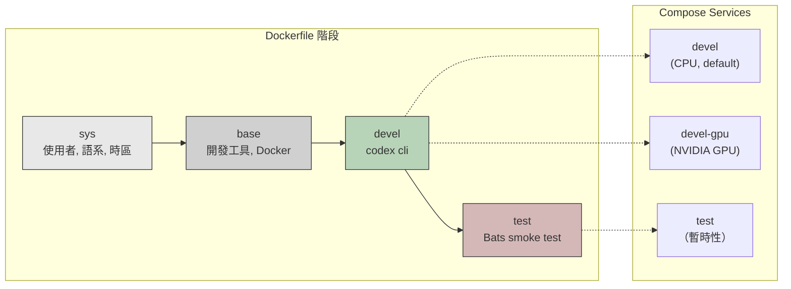
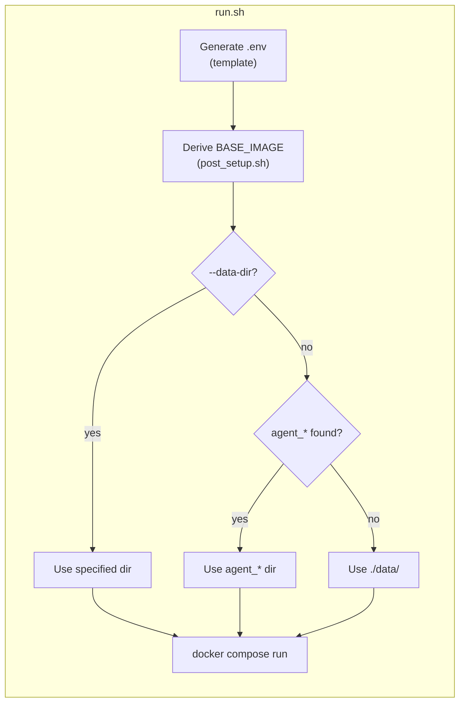

**[English](../README.md)** | **繁體中文** | **[简体中文](README.zh-CN.md)** | **[日本語](README.ja.md)**

# Codex CLI Docker 環境

OpenAI Codex CLI 的 Docker-in-Docker（DinD）開發容器，提供 CPU 與 NVIDIA GPU 兩種版本。以非 root 用戶運行，並與主機的 UID/GID 相符。

## 目錄

- [TL;DR](#tldr)
- [概述](#概述)
- [前置條件](#前置條件)
- [快速開始](#快速開始)
- [對話持久化](#對話持久化)
- [執行多個實例](#執行多個實例)
- [驗證方式](#驗證方式)
  - [OAuth（互動式登入）](#oauth互動式登入)
  - [API 金鑰（加密）](#api-金鑰加密)
- [作為 Subtree 使用](#作為-subtree-使用)
- [設定](#設定)
- [Smoke Tests](#smoke-tests)
- [架構](#架構)
  - [Dockerfile 階段](#dockerfile-階段)
  - [Compose 服務](#compose-服務)
  - [進入點流程](#進入點流程)
  - [預安裝工具](#預安裝工具)
  - [容器能力](#容器能力)

## TL;DR

```bash
./build.sh && ./run.sh    # Build and run (CPU, default)
```

- 附帶 OpenAI Codex CLI 的隔離 Docker-in-Docker 容器
- 非 root 用戶，自動從主機偵測 UID/GID
- 首次啟動時自動複製 OAuth 憑證，對話記錄持久化儲存於本地
- 可選擇以 GPG AES-256 加密 API 金鑰
- 預設使用 CPU，GPU 版本請執行 `./run.sh devel-gpu`

## 概述







## 前置條件

- Docker 並支援 Compose V2
- GPU 版本需要 [nvidia-container-toolkit](https://docs.nvidia.com/datacenter/cloud-native/container-toolkit/install-guide.html)
- 主機端已完成 Codex CLI 的 OAuth 登入（`codex`）

## 快速開始

```bash
# Build (auto-generates .env on every run)
./build.sh              # CPU variant (default)
./build.sh devel-gpu    # GPU variant
./build.sh --no-env test  # 建置但不更新 .env

# Run
./run.sh                          # CPU variant (default)
./run.sh devel-gpu                # GPU variant
./run.sh --data-dir ../agent_foo  # Specify data directory
./run.sh --no-env -d              # 背景啟動，跳過 .env 更新

# Exec into running container
./exec.sh
```

## 對話持久化

對話記錄與 Session 資料透過 掛載 持久化儲存，容器重啟後仍可保留。

`run.sh` 會從專案目錄向上自動掃描是否存在 `agent_*` 目錄。若找到，資料將儲存於該目錄；否則退回使用 `./data/`。

```
# Example: if ../agent_myproject/ exists
../agent_myproject/
└── .codex/     # Codex CLI conversations, settings, session

# Fallback: no agent_* directory found
./data/
└── .codex/
```

- 首次啟動：OAuth 憑證會從主機複製到資料目錄
- 後續啟動：資料目錄已有資料，直接使用（不會覆寫）
- 可自由複製、備份或移動資料目錄
- 手動指定：`./run.sh --data-dir /path/to/dir`

## 執行多個實例

使用 `--project-name`（`-p`）建立完全隔離的實例，每個實例各有獨立的命名 volume：

```bash
# Instance 1
docker compose -p codex1 --env-file .env run --rm devel

# Instance 2 (in another terminal)
docker compose -p codex2 --env-file .env run --rm devel

# Instance 3
docker compose -p codex3 --env-file .env run --rm devel
```

若要執行多個實例，請建立各自獨立的 `agent_*` 目錄：

```bash
mkdir ../agent_proj1 ../agent_proj2

./run.sh --data-dir ../agent_proj1
./run.sh --data-dir ../agent_proj2
```

憑證、對話記錄與 Session 資料完全隔離。清理時只需刪除對應目錄：

```bash
rm -rf ../agent_proj1
```

## 驗證方式

支援兩種方式，可同時使用。

### OAuth（互動式登入）

適用於互動式 CLI 使用。請先在主機上登入：

```bash
codex    # Log in to Codex CLI
```

憑證（`~/.codex`）以唯讀方式掛載至容器，並在首次啟動時複製到資料目錄。後續啟動將直接重用現有資料。

### API 金鑰（加密）

適用於程式化 API 存取。金鑰以 GPG（AES-256）加密儲存，不會以明文形式保存。

```bash
# 1. Create plaintext .env
cat <<EOF > .env.keys
OPENAI_API_KEY=sk-xxxxx
EOF

# 2. Encrypt (you will be prompted to set a passphrase)
encrypt_env.sh    # available inside container, or ./encrypt_env.sh on host

# 3. Remove plaintext
rm .env.keys
```

容器啟動時，若偵測到工作區中存在 `.env.gpg`，系統將提示輸入密碼。解密後的金鑰僅以環境變數的形式保存於記憶體中。

> **注意：** `.env` 與 `.env.gpg` 已加入 `.gitignore`。

## 作為 Subtree 使用

此 repo 可透過 `git subtree` 嵌入至其他專案，讓專案自帶 Docker 開發環境。

### 加入你的專案

```bash
git subtree add --prefix=docker/codex_cli \
    https://github.com/ycpss91255-docker/codex_cli.git main --squash
```

加入後的目錄結構範例：

```text
my_project/
├── src/                         # 專案原始碼
├── docker/codex_cli/            # Subtree
│   ├── build.sh
│   ├── run.sh
│   ├── compose.yaml
│   ├── Dockerfile
│   └── template/
└── ...
```

### 建置與執行

```bash
cd docker/codex_cli
./build.sh && ./run.sh
```

`build.sh` 內部使用 `--base-path`，因此無論從何處執行，路徑偵測都能正確運作。

### 工作區偵測行為

<details>
<summary>展開查看作為 subtree 使用時的偵測行為</summary>

當 subtree 位於 `my_project/docker/codex_cli/` 時：

- **IMAGE_NAME**：目錄名稱為 `codex_cli`（非 `docker_*`），因此偵測會退回至 `.env.example`，其中設定了 `IMAGE_NAME=codex_cli` — 可正常運作。
- **WS_PATH**：策略 1（同層掃描）與策略 2（向上遍歷）可能無法匹配，因此策略 3（退回）會解析至上層目錄（`my_project/docker/`）。

**建議**：首次建置後，請編輯 `.env` 中的 `WS_PATH` 指向實際工作區。此值在後續建置中會被保留。

</details>

### 同步上游更新

```bash
git subtree pull --prefix=docker/codex_cli \
    https://github.com/ycpss91255-docker/codex_cli.git main --squash
```

> **注意事項**：
> - 本地修改會由 git 正常追蹤。
> - 若上游修改了與你本地相同的檔案，`subtree pull` 可能會產生合併衝突。
> - **不要**修改 subtree 內的 `template/` — 它由 env repo 自身的 subtree 管理。

## 設定

每次執行 `build.sh` / `run.sh` 時會自動產生 `.env`（可傳入 `--no-env` 跳過）。詳情請參閱 [.env.example](.env.example)。

| 變數 | 說明 |
|------|------|
| `USER_NAME` / `USER_UID` / `USER_GID` | 與主機相符的容器用戶（自動偵測） |
| `GPU_ENABLED` | 自動偵測，用於設定 `BASE_IMAGE` 與 `GPU_VARIANT` |
| `BASE_IMAGE` | `node:20-slim`（CPU）或 `nvidia/cuda:13.1.1-cudnn-devel-ubuntu24.04`（GPU） |
| `WS_PATH` | 掛載至容器內 `~/work` 的主機路徑 |
| `IMAGE_NAME` | Docker 映像名稱（預設：`codex_cli`） |

## Smoke Tests

詳見 [TEST.md](../test/TEST.md)。

## 架構

```
.
├── Dockerfile             # Multi-stage build (sys -> base -> devel -> test)
├── compose.yaml           # Services: devel (CPU), devel-gpu, test
├── build.sh               # Build with auto .env generation
├── run.sh                 # Run with auto .env generation
├── exec.sh                # Exec into running container
├── entrypoint.sh          # DinD startup, OAuth copy, API key decryption
├── encrypt_env.sh         # Helper to encrypt API keys
├── post_setup.sh          # Derives BASE_IMAGE from GPU_ENABLED
├── .env.example           # Template for .env
├── smoke/            # Bats smoke tests
│   ├── codex_env.bats
│   └── test_helper.bash
├── template/   # Auto .env generator (git subtree)
├── README.md
└── README.zh-TW.md
```

### Dockerfile 階段

| 階段 | 用途 |
|------|------|
| `sys` | 用戶/群組建立、語系、時區、Node.js（僅 GPU 版本） |
| `base` | 開發工具、Python、建置工具、Docker、jq、ripgrep |
| `devel` | Codex CLI、進入點、非 root 用戶 |
| `test` | Bats smoke test（暫時性，驗證後捨棄） |

### Compose 服務

| 服務 | 說明 |
|------|------|
| `devel` | CPU 版本（預設） |
| `devel-gpu` | 附 NVIDIA 裝置保留的 GPU 版本 |
| `test` | smoke test（以 profile 控制） |

### 進入點流程

1. 透過 sudo 啟動 `dockerd`（DinD），等待就緒（最多 30 秒）
2. 將唯讀掛載的 OAuth 憑證複製至 `data/` 目錄（僅首次執行）
3. 解密 `.env.gpg` 並將 API 金鑰匯出為環境變數（若存在）
4. 執行 CMD（`bash`）

### 預安裝工具

| 工具 | 用途 |
|------|------|
| Codex CLI | OpenAI AI CLI |
| Docker (DinD) | 容器內的隔離 Docker daemon |
| Node.js 20 | CLI 工具的執行環境 |
| Python 3 | 腳本開發 |
| git, curl, wget | 版本控制與下載 |
| jq, ripgrep | JSON 處理與程式碼搜尋 |
| make, g++, cmake | 建置工具鏈 |
| tree | 目錄視覺化 |

GPU 版本另外包含：CUDA 13.1.1、cuDNN、OpenCL、Vulkan。

### 容器能力

兩種服務皆需要 `SYS_ADMIN`、`NET_ADMIN`、`MKNOD` 能力，並搭配 `seccomp:unconfined`，以確保 DinD 正常運作。內部 Docker daemon 與主機完全隔離。
